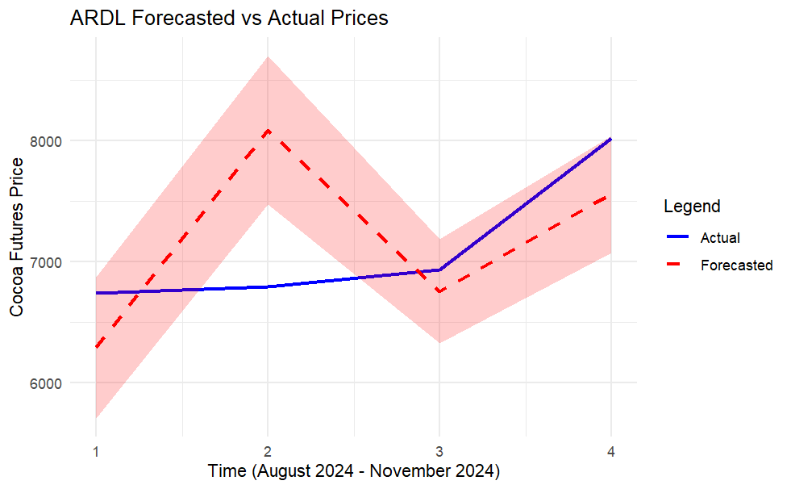
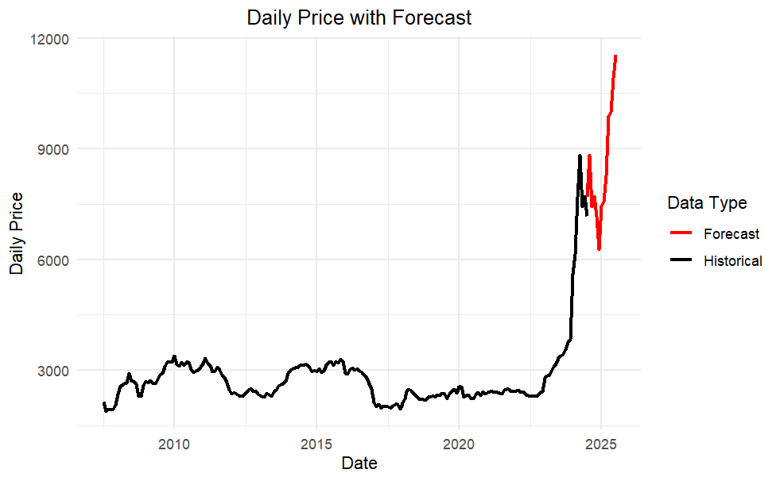

```{r setup, include=FALSE}
knitr::opts_chunk$set(echo = FALSE, message = FALSE, warning = FALSE)
```

```{r}
library(knitr)
library(kableExtra)
library(zoo)
library(tidyverse)
library(forecast)
library(stats)
library(tseries)
library(astsa)
library(MLmetrics)
library(aTSA)
library(dynlm)
library(lmtest)
library(ARDL)
library(caret)
library(quadprog)
library(tseries)
library(urca)
library(vars)
```

# Introduction

Cocoa is a key commodity in the global market; it plays a crucial role in chocolate production, which is one of the largest commodity markets in the world. It is derived from the seeds of the cacao tree (*Theobroma cacao*), which thrives in tropical climates with high humidity and consistent rainfall. Its price is shaped by various factors like weather, geopolitics, exchange rate, and supply chain disruptions. Understanding and forecasting cocoa and its price movements is of great interest to producers, traders, and policymakers. Modelling commodity prices is essential in various industries like agriculture, finance, and trade. However, modelling and forecasting commodity prices can be challenging; multiple factors influence commodity prices and often exhibit characteristics such as seasonality, volatility, and external shocks.

The significance of cocoa price forecasting extends beyond financial speculation; it directly impacts economic planning in cocoa-exporting nations and procurement strategies for global food and beverage companies. 70% of the world's cocoa originates from countries such as Ghana, Ivory Coast, Nigeria, and Cameroon, making the West African region critical to global cocoa. This project focuses on forecasting cocoa futures prices through time series analysis, exploring the question: **How do weather patterns and exchange rate fluctuations in West African countries, mainly Ghana and Cameroon, influence global cocoa futures prices?** 

This research question is explored using two forecasting models. First, a baseline ARIMA(9,1,1) model captures the autocorrelation and moving average structure in historical cocoa price data. Second, a more sophisticated ARDL model is constructed to assess the short-run and long-run relationships between cocoa prices and macro-climatic variables such as exchange rates and average temperatures. The ARDL approach is particularly appropriate given the presence of cointegration among the variables, allowing for a meaningful interpretation of economic relationships over time.

Time series forecasting involves analyzing historical data points collected over time to predict future values. It is particularly suited to financial and economic datasets, which often exhibit trends, seasonality, and autocorrelation. In this project, two key time series models are employed. The **ARIMA (Autoregressive Integrated Moving Average)** model is a classical statistical approach that captures patterns in a single time series by accounting for its own past values and past forecast errors. It is widely used for its simplicity and effectiveness in short-term forecasting (Shumway & Stoffer, 2017). The **ARDL (Autoregressive Distributed Lag)** combines short-run dynamics with long-run equilibrium relationships among multiple time series. This model is particularly powerful when variables are integrated of different orders (I(0) or I(1)) and potentially cointegrated, making it suitable for macroeconomic modeling involving both climatic and financial predictors (Natsiopoulos et al., 2001).

Several methodological and practical challenges were encountered during the study. Cocoa futures data exhibited non-stationarity, needing differencing and unit root testing. Inconsistencies and missing observations in daily data also posed a concern, which was addressed by aggregating the series to monthly averages. Furthermore, aligning exchange rates and climate data from multiple countries required extensive preprocessing. These challenges highlight the inherent complexity in modeling real-world commodity prices, which often violate the assumption of being independently and identically distributed (i.i.d.). In time series contexts, the i.i.d. assumption is rarely satisfied because observations tend to exhibit serial correlation, seasonality, and evolving variance over time. Such dependencies must be explicitly modeled, as ignoring them can lead to biased estimates and unreliable forecasts. Furthermore, the presence of structural breaks and external shocks introduces additional layers of difficulty in capturing stable relationships across time (Shumway & Stoffer, 2017).

This paper delves into the usage of the baseline ARIMA and advanced ARDL model for the forecasting of the global cocoa futures pricing in Cameroon and Ghana, mainly examining two factors: exchange rate fluctuations and weather patterns.

# Literature Review

## ARIMA Literature

Sukiyono et al. (2018) conducted a study on international and Indonesian cocoa prices using data from 2008 to 2016. The authors applied three forecasting models: Autoregressive Integrated Moving Average (ARIMA), exponential smoothing, and decomposition. The study found that ARIMA outperformed the other models based on three evaluation metrics: Mean Absolute Percentage Error (MAPE), Mean Absolute Deviation (MAD), and Mean Squared Deviation (MSD). While the dataset is relatively old, it remains stable and provides valuable insights. Additionally, the study acknowledged Ghana’s significant role in the global cocoa market.

Similarly, Assis, Amran, and Remali (2010) analyzed cocoa price forecasting using data from 1992 to 2006 on Bagan Datoh cocoa, a local Malaysian variety. The authors examined four models: exponential smoothing, ARIMA, Generalized Autoregressive Conditional Heteroskedasticity (GARCH), and a combination of ARIMA and GARCH. Their analysis incorporated multiple goodness-of-fit criteria, including Akaike Information Criterion (AIC), as well as evaluation metrics such as Root Mean Squared Error (RMSE), Mean Absolute Error (MAE), and MAPE. The study concluded that the GARCH model provided the most accurate forecasts for Malaysian cocoa prices.

## ARDL Literature

The central modeling hypothesis of this paper is that cocoa prices can be explained by a set of regressors, specifically the exchange rates and average temperatures of four countries. Additionally, the model assumes that lagged values of these predictor variables also influence cocoa prices. It is likely that buy and sell decisions in the cocoa market are based on historical data, where speculators use past exchange rates and temperature trends to predict future price movements. This justifies the use of the Autoregressive Distributed Lag (ARDL) model, which effectively incorporates dynamic lag structures.

Commodity price forecasting has traditionally sought to examine the long-term relationships between the target variable and other explanatory factors through cointegration analysis. Understanding these long-term dynamics and their influence on short-term fluctuations has been instrumental in improving the prediction and interpretation of commodity price movements. In their study Forecasting Commodity Prices: Futures Versus Judgment, Bowman and Husain employ an error correction model (ECM) to model long-term relationships and forecast commodity prices. Their findings indicate that ECM-based forecasts outperform other methods for eight out of fifteen commodities. This result motivates the present study’s exploration of an ECM framework for modeling cocoa prices. (Husain, & Bowman, 2004)

Building on insights from both ARDL and ECM, this paper adopts an ARDL-ECM approach. According to Hassler and Wolters in *Autoregressive Distributed Lag models and Cointegration*, the ARDL model is particularly well-suited for cointegration analysis involving multiple variables. The ARDL-ECM framework is advantageous as it captures both short-run dynamics and long-term relationships, provided that all time series variables are either integrated of order zero, I(0), or integrated of order one, I(1), in terms of stationarity.(Hassler & Wolters, n.d.)

In the context of cocoa price forecasting, Coulibaly et al. in *Climate Change Effects on Cocoa Export: Case Study of Côte d’Ivoire* employ an ARDL-ECM model to assess the impact of climate variables on cocoa prices. Their findings indicate that temperature indirectly affects cocoa prices through yield loss, as unfavorable temperatures reduce cocoa production, leading to higher prices. Additionally, while exchange rates also exhibit an indirect influence on cocoa prices, this effect is not always statistically significant. Nevertheless, given its potential relevance, exchange rate dynamics will be incorporated into the present analysis.(K. Coulibaly et al., n.d.)

# Data

This study utilizes three main datasets to model and forecast cocoa futures prices. The primary dataset is the Daily Prices ICCO.csv file, which contains daily closing prices for cocoa futures contracts traded on major commodity exchanges. Spanning from March 10, 1994, to February 27, 2025, this dataset was obtained from the International Cocoa Organization (ICCO) and serves as the target variable in all forecasting models (International Cocoa Organization, 2025).

Ghana, being the second-largest cocoa producer globally, plays a critical role in shaping global cocoa supply and pricing dynamics. The Ghanaian dataset used in this study comprises two main components: exchange rate data and climate data. The exchange rate series, included in the file ghana_final.csv, records daily Ghanaian cedi to U.S. dollar conversion rates from July 13, 2007, to November 28, 2024. This data was sourced from Google Finance and merged with corresponding climate data obtained from the National Centers for Environmental Information (NCEI). Although the original dataset also included daily average temperature values from the Ghana data.csv file, these were ultimately excluded from the final model due to low correlation with cocoa futures prices during exploratory analysis. The exchange rate was retained as a key predictor due to its potential impact on export revenues and domestic producer incentives in Ghana’s cocoa sector.

Cameroon, though a smaller producer compared to Ghana, contributes significantly to West African cocoa exports and serves as a relevant comparison in analyzing regional price dynamics. The Cameroonian dataset, saved as cameroon_final.csv, contains daily exchange rate data for the Central African CFA franc to U.S. dollars and daily average temperature readings from July 13, 2007, to November 28, 2024. The exchange rate data was obtained from Google Finance, while the weather data was retrieved using the Open-Meteo historical weather API. Both variables were retained in the final ARDL model as they exhibited relatively strong associations with the cocoa price series. Aggregating this information into monthly averages allowed for better alignment with the cocoa futures dataset and helped reduce volatility caused by short-term fluctuations or missing observations in the raw data.

After preprocessing and aggregation (further discussed in Methods), the datasets were combined into a monthly time series to facilitate model fitting and reduce noise due to missing values and reporting inconsistencies in daily data. Summary statistics and correlation analysis guided the selection of relevant predictors, with only Ghana and Cameroon variables retained in the final ARDL model due to their stronger association with cocoa price movements.

*Note: Initial data for Ivory Coast (Google Finance, 2025d)(Open-Meteo, 2025) and Nigeria (Google Finance, 2025c)(Open-Meteo, 2025), specifically the exchange rate fluctuations and weather were also used, but upon assessing the correlational matrix, Ivory Coast and Nigeria's average temperature and exchange rate data were highly correlated with each other, making them redundant in the model. If added, it would lead to highly inflated and unstable coefficients in the ARDL model, which risks overfitting and is thus excluded from the final forecasting model (further discussed in Forecasting and Results).*

\newpage

```{r, results='asis', echo = FALSE}
data <- data.frame(
  Variable = c("ICCO Price", "Ghana Ex Rate", "Ghana Avg Temp", "Cameroon Ex Rate", 
               "Cameroon Avg Temp", "Ivory Coast Ex Rate", "Ivory Coast Avg Temp", 
               "Nigeria Ex Rate", "Nigeria Avg Temp"),
  Min = c(774.1, 0.0600, 71.00, 0.0015, 68.70, 0.0015, 70.60, 0.0006, 70.40),
  Q1 = c(1559.0, 0.1700, 79.00, 0.0017, 73.80, 0.0017, 76.60, 0.0024, 75.20),
  Median = c(2202.3, 0.2500, 82.00, 0.0017, 75.80, 0.0017, 77.90, 0.0028, 77.30),
  Mean = c(2338.1, 0.3667, 81.57, 0.0018, 76.57, 0.0018, 78.15, 0.0038, 77.29),
  Q3 = c(2735.4, 0.5700, 84.00, 0.0019, 78.90, 0.0020, 79.70, 0.0061, 79.20),
  Max = c(11984.7, 1.0600, 90.00, 0.0022, 87.40, 0.0022, 87.50, 0.0068, 85.80),
  `NA` = c(3324, 1325, 353, 2140, 0, 2142, 0, 2150, 0)
)

kable(data, caption = "Summary Statistics of Key Variables") |>
  kable_styling("striped")
```

The summary statistics in Table 1 provide an overview of global cocoa prices (ICCO Price) and exchange rates and average temperatures in Ghana, Cameroon, Ivory Coast, and Nigeria. The ICCO price has a wide range, from a minimum of 774.1 to a maximum of 11,984.7, with a median of 2,202.3 and a mean of 2,338.1, suggesting potential skewness due to extreme values. Exchange rates vary significantly across countries, with Ghana’s having the highest median (0.25) and Nigeria’s the lowest (0.0028), indicating differences in currency valuation. The average temperatures for all four countries are relatively stable, with median values between 75.8°F and 82°F, suggesting warm climates with slight variations. However, missing values (NA’s) are present, especially in exchange rates, which could impact analyses involving these variables.

```{r, fig.cap='Time Series Plots for Price, Temperature, and Currency Datasets'}
# Data Loading

yearly_data <- read.csv("data/yearly_final.csv")
ghana_data <- read.csv("data/ghana_final.csv")
cameroon_data <- read.csv("data/cameroon_final.csv")
ivorycoast_data <- read.csv("data/ivorycoast_final.csv")
nigeria_data <- read.csv("data/nigera_final.csv")
icco <- read.csv("data/forecasting_icco_final.csv")


icco$daily_price <- as.numeric(gsub(",", "", icco$daily_price))
icco$all_date <- as.Date(icco$all_date)
ghana_data$ghana_date <- as.Date(ghana_data$ghana_date)
yearly_data$year <- as.double(yearly_data$year)
cameroon_data$cameroon_date <- as.Date(cameroon_data$cameroon_date)
ivorycoast_data$ivorycoast_date <- as.Date(ivorycoast_data$ivorycoast_date)
nigeria_data$nigeria_date <- as.Date(nigeria_data$nigeria_date)

icco <- icco[icco$all_date >= as.Date("1994-10-10"), ] 

# summary(icco$daily_price)
# summary(ghana_data$ghana_ex_rate)
# summary(ghana_data$ghana_avg_temp)
# summary(cameroon_data$cameroon_ex_rate)
# summary(cameroon_data$cameroon_avg_temp)
# summary(ivorycoast_data$ivorycoast_ex_rate)
# summary(ivorycoast_data$ivorycoast_avg_temp)
# summary(nigeria_data$nigeria_ex_rate)
# summary(nigeria_data$nigeria_avg_temp)

colnames(nigeria_data)[colnames(nigeria_data)=='nigeria_date'] <- 'Date'
colnames(cameroon_data)[colnames(cameroon_data)=='cameroon_date'] <- 'Date'
colnames(ghana_data)[colnames(ghana_data)=='ghana_date'] <- 'Date'
colnames(ivorycoast_data)[colnames(ivorycoast_data)=='ivorycoast_date'] <- 'Date'
colnames(icco)[colnames(icco)=='all_date'] <- 'Date'

# Time Series

dfs <- list(icco,nigeria_data,ghana_data,ivorycoast_data,cameroon_data)

merged_df <- Reduce(function(x,y) merge(x,y, by='Date', all=TRUE),dfs)

merged_df <- na.omit(merged_df)

merged_df <- merged_df %>% 
  mutate(YearMonth = format(Date, "%Y-%m")) %>%
  group_by(YearMonth) %>% 
  summarise(daily_price = mean(daily_price, na.rm = TRUE), 
            nigeria_ex_rate = mean(nigeria_ex_rate), 
            nigeria_avg_temp = mean(nigeria_avg_temp), 
            ghana_ex_rate = mean(ghana_ex_rate), 
            ghana_avg_temp = mean(ghana_avg_temp), 
            cameroon_ex_rate = mean(cameroon_ex_rate), 
            cameroon_avg_temp = mean(cameroon_avg_temp), 
            ivorycoast_ex_rate = mean(ivorycoast_ex_rate), 
            ivorycoast_avg_temp = mean(ivorycoast_avg_temp))

merged_df$YearMonth <- as.yearmon(merged_df$YearMonth, format = "%Y-%m")
merged_df <- na.omit(merged_df)

ts_data <- ts(merged_df[, -1], start = c(2007, 7), frequency = 12) 

par(mfrow = c(3, 3))

plot(ts_data[,1],type = "l", col = "blue", 
     main = "TS for daily price", 
     xlab = "Time", ylab = "monthly price")

plot(ts_data[,2],type = "l", col = "blue", 
     main = "TS for nigeria ex rate", 
     xlab = "Time", ylab = "monthly ex rate")

plot(ts_data[,3],type = "l", col = "blue", 
     main = "TS for nigeria avg temp", 
     xlab = "Time", ylab = "monthy avg temp")

plot(ts_data[,4],type = "l", col = "blue", 
     main = "TS for ghana ex rate", 
     xlab = "Time", ylab = "monthly ex rate")

plot(ts_data[,5],type = "l", col = "blue", 
     main = "TS for ghana avg temp", 
     xlab = "Time", ylab = "monthly avg temp")

plot(ts_data[,6],type = "l", col = "blue", 
     main = "TS for Cameroon ex rate", 
     xlab = "Time", ylab = "monthly ex rate")

plot(ts_data[,7],type = "l", col = "blue", 
     main = "TS for Cameroon avg temp", 
     xlab = "Time", ylab = "monthly avg temp")

plot(ts_data[,8],type = "l", col = "blue", 
     main = "TS for ivorycoast ex rate", 
     xlab = "Time", ylab = "monthly ex rate")

plot(ts_data[,9],type = "l", col = "blue", 
     main = "TS for ivorycoast avg temp", 
     xlab = "Time", ylab = "monthly avg temp")
```

# Methodology

## Data Preprocessing
The initial stage of data preprocessing involved compiling and aligning datasets by country, ensuring temporal consistency across all series. Given the extended time span of the data, ranging from approximately 1990 to 2025, many variables contained missing or irregularly spaced observations. An early attempt to impute missing values using overall averages proved ineffective due to the high variability and long historical range of the data, which rendered global averages unrepresentative. Usually, the global exchanges are closed on weekends and public holidays as they are non-trading days; there were a lot of missing values (also seen in the summary statistics in the Data section). As an alternative, a more robust strategy was adopted: computing monthly averages based only on the available daily values for each month. For instance, if at least five daily observations were available within a given month, their mean was taken as the representative monthly value, and missing values were simply excluded rather than imputed. This method significantly reduced noise and preserved the underlying data structure, allowing for clearer trends to emerge in the resulting time series. The monthly aggregation not only smoothed out short-term volatility but also facilitated alignment across variables and improved model performance in subsequent analysis.

## ARIMA Model
The Autoregressive Integrated Moving Average (ARIMA) model was implemented as a baseline approach for forecasting cocoa futures prices. The analysis began by importing the ICCO daily cocoa price data, which was then aggregated into monthly averages to address missing data and stabilize short-term fluctuations. The resulting series was converted into a univariate time series object. The stationarity of the price series was evaluated using the Augmented Dickey-Fuller (ADF) test, which indicated non-stationarity at level but stationarity after first differencing, justifying the use of an integrated model with d=1 d =1 d=1. Autocorrelation and partial autocorrelation plots of the differenced series informed the choice of lags for the autoregressive (AR) and moving average (MA) components. A model with order (9,1,1) was selected based on its performance and fit, capturing the long-memory structure and noise patterns observed in the data. The fitted ARIMA(9,1,1) model was then summarized to assess parameter significance and residual diagnostics.

## SARIMA Model and Spectral Analysis

To explore the possibility of seasonal patterns in cocoa prices, a seasonal decomposition was initially conducted using exponential smoothing state space modeling (ETS). The seasonal characteristics were further investigated using spectral density estimation, which identified dominant cyclical components in the frequency domain. Although this analysis revealed some periodicity, the visual inspection of the decomposed ETS model and the results of spectral analysis did not indicate strong or consistent seasonality that warranted the addition of seasonal parameters in the ARIMA framework. As a result, a full Seasonal ARIMA (SARIMA) model was not implemented in the final forecasting pipeline. However, this exploratory step provided valuable insight into the frequency structure of cocoa prices and supported the decision to proceed with a non-seasonal ARIMA model.

## ARDL Model
The Autoregressive Distributed Lag - Error Correction Model (ARDL-ECM) was employed as a more explanatory framework to analyze the impact of macroeconomic and climate variables on cocoa futures prices. The model incorporated monthly averaged data from Ghana and Cameroon, including exchange rates and average temperatures, as well as a time trend to capture structural climate effects. Prior to estimation, each series was tested for stationarity using the ADF test and found to be either I(0) or I(1), satisfying the conditions for ARDL modeling. Cointegration between cocoa prices and predictor variables was verified using the Engle-Granger two-step method, confirming the existence of a long-run equilibrium relationship. Optimal lag orders were selected using the auto_ardl() function, and several model variations were estimated on both full and truncated datasets to account for potential structural breaks. Diagnostic tests were conducted to evaluate normality, autocorrelation, and homoskedasticity of residuals. An ARDL-ECM structure was then specified to isolate short-run dynamics and long-run effects, offering interpretable insights into how exchange rate fluctuations and climate variations influence cocoa prices over time. Ultimately, the ARDL-ECM model and ARDL model were equivalent hence, ARDL was the final version used for forecasting. For ARDL forecasting, ARIMA models for each predictor variable were constructed and used to generate forecasts from December 2024 to July 2025 (training split). These forecasted values were then fed into the ARDL model, along with the lagged values of the predictors from July 2024 to November 2024 (testing split), to predict monthly prices from December 2024 to July 2025 (forecasting split). Initially, data for Ivory Coast (Google Finance, 2025d)(Open-Meteo, 2025) and Nigeria (Google Finance, 2025c)(Open-Meteo, 2025), specifically the exchange rate fluctuations and weather were also used, but upon assessing the correlational matrix, Ivory Coast and Nigeria's average temperature and exchange rate data were highly correlated with each other, making them redundant in the model. If added, it would lead to highly inflated and unstable coefficients in the ARDL model, which risks overfitting and is thus excluded from the final forecasting model (further discussed in Forecasting and Results).

# Forecasting and Results

When the data was cleaned, it aligned from 2007 to 2024. As a result, the model was trained on data from July 2007 to July 2024, tested on data from August 2024 to November 2024, and used to generate forecasts from December 2024 to July 2025. Since data is available for December 2024 to February 2025, cross-validation can be performed during that period to assess the model’s performance, given that the price of cocoa is already known up to the present date.

## ARIMA Model

An ARIMA(p, d, q) model follows the formula:

$$(1 - \phi_1B - \phi_2B^2 - ... - \phi_pB^p)(1 - B)^d Y_t = (1 + \theta_1B + \theta_2B^2 + ... + \theta_pB^\phi)\epsilon_t$$

Where:

- $Y_t$ is the time series value at time t
- $B$ is the backshift operator (shifts values back in time)
- $d$ is the number of times the series is differenced to make it stationary
- $\phi$ terms represent the autoregressive (AR) part
- $\theta$ terms represent the moving average (MA) part
- $\epsilon_t$ is random error (white noise)

For an ARIMA(1,1,1) model, the formula simplifies to:

$$(1 - \phi_1B)(1 - B) Y_t = (1 + \theta_1B)\epsilon_t$$

And the forecasting equation is:

$$Y_t = Y_{t-1} + \phi_1 (Y_{t-1} - Y_{t-2}) + \theta_1 \epsilon_{t-1} + \epsilon_t$$

Where:

- $Y_t$ is the predicted value at time t
- $Y_{t-1}$ is the previous value
- $\phi_1$ is the autoregressive (AR) coefficient
- ($Y_{t-1} - Y_{t-2}$) represents the differencing step to remove trends
- $\theta_1$ is the moving average (MA) coefficient
- $\epsilon_t$ and $\epsilon_{t-1}$ are random error terms

```{r, fig.width=6, fig.height=4, fig.cap='ARIMA Forecast on Testing Data from August 2024 to November 2024'}
icco <- read_csv("data/Daily Prices_ICCO.csv", show_col_types = FALSE)

icco <- icco |>
  rename("date" = Date,
         "price" = `ICCO daily price (US$/tonne)`) |>
  mutate(date = as.Date(date, format = "%d/%m/%Y")) |>
  arrange(date) |>
  mutate(day = day(date),
         week = week(date),
         month = month(date),
         year = year(date))

price_ts <- icco |>
  dplyr::select(month, year, price) |>
  group_by(year, month) |>
  summarise(price = mean(price)) |>
  pull(price)

price_ts_train <- price_ts[154:358] |>
  as.ts()

price_ts_test <- price_ts[359:362] |>
  as.ts()

# Spectral Analysis

# n <- length(as.numeric(price_ts_train))
# n1 <- nextn(n)
# 
# par(mfrow=c(1,1))
# price_ts_train.per <- mvspec(price_ts_train, log="yes")
# u <- which.max(price_ts_train.per$spec)
# 
# LCL <- 2*price_ts_train.per$spec[2]/qchisq(.975,2)
# UCL <- 2*price_ts_train.per$spec[2]/qchisq(.025,2)

# ARIMA Analysis

# tseries::adf.test(price_ts_train)
# 
diff_price_ts_train <- diff(price_ts_train)
# tseries::adf.test(diff_price_ts_train)
# 
# acf(diff_price_ts_train)
# pacf(diff_price_ts_train)

model <- Arima(diff_price_ts_train, order = c(2, 1, 2))

t1 <- c(price_ts_train, price_ts_test)

training_forecast <- forecast::forecast(model, h = 4) |>
  as.data.frame() |>
  pull(`Point Forecast`) |>
  cumsum() +
  price_ts_train[205]

df <- data.frame(
  time = rep(1:4, 2),
  price = c(c(price_ts_train, training_forecast)[206:209],
            t1[206:209]),
  type = rep(c("Forecast", "Actual"), each = 4)
)

ggplot(df, aes(x = time, y = price, color = type)) +
  geom_line() +
  scale_color_manual(values = c("Forecast" = "blue", "Actual" = "black")) +
  scale_y_continuous(limits = c(6000, 8000)) +
  labs(x = "Time (August 2024 - November 2024)", y = "Price ($)", color = "Legend")
```

Figure 2 illustrates the actual and forecasted cocoa prices from August to November 2024, generated using an ARIMA model. The forecast (blue line) demonstrates a relatively stable trend within a narrow price range, while the actual prices (black line) exhibit more significant fluctuations, including a sharp decline in September and a substantial surge in November. Notably, the ARIMA model fails to capture this late upward trend, leading to a considerable divergence between the forecast and the actual observed prices. This suggests a limitation in the model's ability to predict sudden shifts or external factors influencing the cocoa market during this period, warranting a potential re-evaluation of the model's parameters or consideration of alternative forecasting methodologies for improved accuracy.

```{r, fig.width=6, fig.height=4, fig.cap='ARIMA Forecast for Cocoa Price from December 2024 to July 2025'}
future_forecast <- forecast::forecast(model, h = 8) |>
  as.data.frame() |>
  pull(`Point Forecast`) |>
  cumsum() +
  t1[209]

t2 <- c(t1, future_forecast)

df <- data.frame(
  time = c(1:length(t1), (length(t1) + 1):length(t2)),
  price = c(t1, future_forecast),
  type = c(rep("Actual", length(t1)), rep("Forecast", length(future_forecast)))
)

ggplot(df, aes(x = time, y = price, color = type)) +
  geom_line() +
  scale_color_manual(name = "Legend", values = c("Actual" = "black", "Forecast" = "red")) +
  labs(x = "Time (July 2007 - November 2024)", y = "Price ($)")

# residuals <- residuals(model)
# shapiro <- shapiro.test(residuals)
# arch <- arch.test(estimate(diff_price_ts_train, p = 1, d = 1, q = 1))
```

Figure 3 illustrates a significant failure of the ARIMA model to accurately forecast cocoa prices for November 2024, as the actual price exhibits a dramatic upward surge immediately preceding and presumably continuing into the forecast period, while the model predicts a relatively flat trajectory at a much lower price point. This stark divergence highlights the ARIMA model's inability to capture the sudden and substantial shift in market dynamics, suggesting a potential structural change or the influence of unmodeled external factors driving the recent price explosion. Consequently, the forecast lacks practical value and underscores the need for a more responsive forecasting approach capable of adapting to rapidly evolving market conditions.

\newpage

## ARDL Model

$$
Y_t = \beta_0 + \beta_1 Y_{t-1} + \beta_2 Y_{t-2} + \ldots + \beta_5 Y_{t-5}
$$

$$
+ \gamma_0 X_{1,t} + \ldots + \gamma_5 X_{1,t-5}
+ \delta_0 X_{2,t} + \ldots + \delta_5 X_{2,t-5}
$$

$$
+ \theta_0 X_{3,t} + \ldots + \theta_5 X_{3,t-5}
+ \lambda_0 X_{4,t} + \ldots + \lambda_5 X_{4,t-5}
+ \tau_0 T_t + \ldots + \tau_5 T_{t-5} + \epsilon_t
$$

- $Y_t$ = Daily price
- $X_1$ = Cameroon exchange rate
- $X_2$ = Cameroon average temperature
- $X_3$ = Ghana exchange rate
- $X_4$ = Ghana average temperature
- $T_t$ = Trend variable
- $\epsilon_t$ = Error term

$$
Y_t = 1.486 \times 10^3 + 1.199 Y_{t-1} + 1.249 Y_{t-2} + 8.837 \times 10^{-2} Y_{t-3}
$$

$$
+ 1.150 Y_{t-4} + 7.431 \times 10^1 Y_{t-5}
+ (3.543 \times 10^5) X_{1,t} + (2.050 \times 10^5) X_{1,t-1} - (7.765 \times 10^3) X_{1,t-2}
$$

$$
- (6.272 \times 10^5) X_{1,t-3} - (1.482 \times 10^5) X_{1,t-4} - (1.339 \times 10^5) X_{1,t-5}
- (2.995 \times 10^1) X_{2,t} + 1.569 X_{2,t-1} - 1.579 X_{2,t-2}
$$

$$
- 6.612 X_{2,t-3} + 5.887 X_{2,t-4} - 3.244 X_{2,t-5}
- (2.766 \times 10^2) X_{3,t} + 1.871 X_{3,t-1} - 1.862 X_{3,t-2}
$$

$$
+ 1.693 X_{3,t-3} - 1.964 X_{3,t-4} - 1.290 X_{3,t-5}
- (9.584 \times 10^2) X_{4,t} + 8.297 X_{4,t-1} + 2.917 X_{4,t-2}
$$

$$
+ 7.165 X_{4,t-3} - 3.507 X_{4,t-4} + 1.150 T_t + \epsilon_t
$$

```{r, eval = FALSE}
# Define response variable (Y) and predictors (X1, X2, ..., X8)
response_var <- "daily_price"  # Replace with the actual response variable name
predictor_vars <- c("nigeria_ex_rate", "nigeria_avg_temp", 
                    "ghana_ex_rate", "ghana_avg_temp", "cameroon_ex_rate", "cameroon_avg_temp", "ivorycoast_ex_rate", "ivorycoast_avg_temp")  # Replace with actual predictor names

# Create a dataframe to store results
adf_results <- data.frame(Predictor = character(), 
                          ADF_Stat = numeric(), 
                          P_Value = numeric(), 
                          Critical_1pct = numeric(), 
                          Critical_5pct = numeric(), 
                          Critical_10pct = numeric(), 
                          stringsAsFactors = FALSE)

for (predictor in predictor_vars) {
  
  # Run linear regression: Response ~ Predictor
  model <- lm(as.formula(paste(response_var, "~", predictor)), data = ts_data)
  
  # Extract residuals
  residuals_model <- residuals(model)
  
  # Perform ADF test on residuals
  adf_test <- ur.df(residuals_model, type = "none", lags = 5)
  
  # Extract results
  adf_stat <- adf_test@teststat[1]  # ADF test statistic
  critical_values <- adf_test@cval[1, ]  # Critical values
  
  # Store results in dataframe
  adf_results <- rbind(adf_results, data.frame(
    Predictor = predictor,
    ADF_Stat = adf_stat,
    Critical_1pct = critical_values["1pct"],
    Critical_5pct = critical_values["5pct"],
    Critical_10pct = critical_values["10pct"]
  ))
}

# testing for stationarity

series_names <- colnames(ts_data)  # Extract column names

# Function to perform ADF test and extract test stat
adf_test_results <- function(series, name) {
  test <- ur.df(series, type = "none", lags = 5)  # ADF Test
  # Extract test statistic
  test_stat <- summary(test)@teststat[1]  
  
  # Extract critical values
  critical_values <- test@cval[1, ]  # 1% , 5% , 10% levels
  
  return(data.frame(Series = name, 
                    ADF_Stat = test_stat, 
                    Critical_1pct = critical_values["1pct"], 
                    Critical_5pct = critical_values["5pct"], 
                    Critical_10pct = critical_values["10pct"]))
  
  
}

# Apply ADF test to each column in merged_df
results <- do.call(rbind, lapply(series_names, function(col) adf_test_results(ts_data[, col], col)))

compute_diffs <- function(series_name, data) {
  order <- ndiffs(data[,series_name], test='adf')  # Compute differencing order
  return(data.frame(Series = series_name, Differencing_Order = order))
}

# Apply the function to each column in the dataframe
results_diff <- bind_rows(lapply(colnames(ts_data), compute_diffs, data = ts_data))

#trend stationarity and structural break tests

#cameroon avg temp
adf_test_trend_cam <- ur.df(ts_data[,'cameroon_avg_temp'], type = "trend", lags = 1)

#summary(ur.za(merged_df$cameroon_avg_temp, model = "both"))

#ghana avg temp
adf_test_trend_ghana <- ur.df(ts_data[,'ghana_avg_temp'], type = "trend", lags = 1)

#summary(ur.za(merged_df$ghana_avg_temp, model = "both"))

#nigeria avg temp
adf_test_trend_nig <- ur.df(ts_data[,'nigeria_avg_temp'], type = "trend", lags = 1)

trend <- seq_along(ts_data[, 1])  # Create a time series of increasing numbers (1, 2, 3, ...)


# Add the trend variable to the data frame
merged_df$trend <- trend

set.seed(123)

train_data <- merged_df[0:205,]
test_data <- merged_df[201:nrow(merged_df),] 


optimal_model_train <- auto_ardl(daily_price ~ cameroon_ex_rate + cameroon_avg_temp + ghana_ex_rate + ghana_avg_temp + trend, data = train_data[, -1], max_order = 5)

# Ensure trend is numeric
merged_df$trend <- as.numeric(1:nrow(merged_df))

# make columns numeric data type
merged_df$daily_price <- as.numeric(merged_df$daily_price)
merged_df$nigeria_ex_rate <- as.numeric(merged_df$nigeria_ex_rate)
merged_df$ghana_avg_temp <- as.numeric(merged_df$ghana_avg_temp)
merged_df$nigeria_avg_temp <- as.numeric(merged_df$nigeria_avg_temp)
merged_df$ghana_ex_rate <- as.numeric(merged_df$ghana_ex_rate)
merged_df$cameroon_avg_temp <- as.numeric(merged_df$cameroon_avg_temp)
merged_df$cameroon_ex_rate <- as.numeric(merged_df$cameroon_ex_rate)
merged_df$ivorycoast_ex_rate <- as.numeric(merged_df$ivorycoast_ex_rate)
merged_df$ivorycoast_avg_temp <- as.numeric(merged_df$ivorycoast_avg_temp)

merged_df <- na.omit(merged_df)

best_model_train <- ardl(daily_price ~ cameroon_ex_rate + cameroon_avg_temp + ghana_ex_rate + ghana_avg_temp + trend,
  data = train_data[, -1],
 order = c(5,5,5,5,5,5))


# Bounds Test for Cointegration with multiple independent variables
uecm_model <- uecm(best_model_train, data=train_data[, -1])
#bounds_f_test(best_model_1, case = 3)

get_model_metrics <- function(model) {
  residuals <- residuals(model)
  
  # Perform Tests
  ljung <- Box.test(residuals, lag = 10, type = "Ljung-Box")$p.value
  bp <- bptest(model)$p.value
  shapiro <- shapiro.test(residuals)$p.value
  aic_val <- AIC(model)
  bic_val <- BIC(model)
  
  # Return Results
  return(c(Ljung_Box = ljung, BP_Test = bp, Shapiro_Test = shapiro, 
           AIC = aic_val, BIC = bic_val))
}

model_metrics <- rbind(
  Model_without_2324 = get_model_metrics(best_model_train),model_eucm = get_model_metrics(uecm_model)
  
)

# Convert to Data Frame for Better Viewing
model_metrics_df <- as.data.frame(model_metrics)

#calculting training and testing RMSE

L <- function(x, k) dplyr::lag(x, k)
#max_lag <- max(c(2, 5, 0, 0, 0, 2))  # Get the highest lag in your model

# Ensure `test_set` has enough historical data
#test_data <- bind_rows(tail(train_data, max_lag), test_data)

predictions_test <- predict(best_model_train, newdata=test_data,se.fit=TRUE)

actual_values_test <- test_data$daily_price

actual_values_train <- train_data$daily_price

predictions_test_final <- predictions_test$fit

#training predictions
predictions_train <- predict(best_model_train, newdata=train_data,se.fit=TRUE)


# Now you can calculate performance metrics for the trimmed test data
rmse_test <- sqrt(mean((actual_values_test - predictions_test_final)^2, na.rm = TRUE))
mae <- mean(abs(actual_values_test - predictions_test_final), na.rm = TRUE)

rmse_train <- sqrt(mean((actual_values_train - predictions_train$fit)^2, na.rm = TRUE))

#max(merged_df_break$daily_price)

# Assuming your actual and forecasted values are in vectors: actual_prices and forecasted_prices
# And you have a time variable or index (e.g., time_index)
forecast_se <- predictions_test$se.fit
data <- data.frame(
  Time = 1:(length(actual_values_test)-5),
  Actual = actual_values_test[6:length(actual_values_test)],
  Forecasted = predictions_test_final[6:length(actual_values_test)],
  Lower_Bound = predictions_test_final[6:length(actual_values_test)] - 1.96 * forecast_se[6:length(actual_values_test)],  # 95% Lower CI
  Upper_Bound = predictions_test_final[6:length(actual_values_test)] + 1.96 * forecast_se[6:length(actual_values_test)]   # 95% Upper CI
)


# Create the line plot
# ggplot(data, aes(x = Time)) +
#   geom_line(aes(y = Actual, color = "Actual"), size = 1) +    # Actual values line
#   geom_line(aes(y = Forecasted, color = "Forecasted"), size = 1, linetype = "dashed") +  geom_ribbon(aes(ymin = Lower_Bound, ymax = Upper_Bound), fill = "red", alpha = 0.2) + # Forecasted values line
#   labs(title = "ARDL Forecasted vs Actual Prices", 
#        x = "Time (August 2024 - November 2024)", 
#        y = "Cocoa Futures Price") +
#   scale_color_manual(name = "Legend", values = c("Actual" = "blue", "Forecasted" = "red")) +
#   theme_minimal()
```

```{r}
predictor_models <- data.frame(
  Predictor = c("Cameroon Average Temperature", "Cameroon Exchange Rate", 
                "Ghana Average Temperature", "Ghana Exchange Rate"),
  Model = c("ARIMA(0,0,3)", "ARIMA(0,1,1)", 
            "ARIMA(0,0,3)", "ARIMA(0,1,3)")
)

kable(predictor_models, caption = "ARIMA Models for Cocoa Price Predictors") |>
  kable_styling("striped")
```

```{r, fig.width=4, fig.height=3, fig.cap='ARDL Forecast on Testing Data from August 2024 to November 2024'}

```

In the forecast plot comparing predicted and actual prices during the test period, the model initially overestimates prices in August and September 2024. Then, there is a phase of underestimation in October and November. The initial overestimation is likely due to the model being trained on the 2023–2024 spike, which is not representative of typical market behavior.

```{r, eval = FALSE}
#SARIMA for cameroon temperature

library(smooth)

ts_data <- ts_data[0:205,]

# SARIMA for cameroon temperature
sarima_cameroon_temp <- auto.ssarima(ts_data[,'cameroon_avg_temp'])

summary(sarima_cameroon_temp)
  
#auto.arima(merged_df$cameroon_avg_temp, seasonal=TRUE,stepwise=FALSE, approximation=FALSE, trace=FALSE)

checkresiduals(sarima_cameroon_temp)

Box.test(sarima_cameroon_temp$residuals, lag = 10, type = "Ljung-Box")$p.value


# SARIMA for cameroon exchange rate
sarima_cameroon_ex <- auto.ssarima(ts_data[,'cameroon_ex_rate'])

summary(sarima_cameroon_ex)
  
#auto.arima(merged_df$cameroon_avg_temp, seasonal=TRUE,stepwise=FALSE, approximation=FALSE, trace=FALSE)

checkresiduals(sarima_cameroon_ex)

Box.test(sarima_cameroon_ex$residuals, lag = 10, type = "Ljung-Box")$p.value


#SARIMA for ghana temperature
sarima_ghana_temp <- auto.ssarima(ts_data[,'ghana_avg_temp'])

summary(sarima_ghana_temp)
  
#auto.arima(merged_df$cameroon_avg_temp, seasonal=TRUE,stepwise=FALSE, approximation=FALSE, trace=FALSE)

checkresiduals(sarima_ghana_temp)

Box.test(sarima_ghana_temp$residuals, lag = 10, type = "Ljung-Box")$p.value


# SARIMA for ghana exchange rate
sarima_ghana_ex <- auto.ssarima(ts_data[,'ghana_ex_rate'])

summary(sarima_ghana_ex)
  
#auto.arima(merged_df$cameroon_avg_temp, seasonal=TRUE,stepwise=FALSE, approximation=FALSE, trace=FALSE)

checkresiduals(sarima_ghana_ex)

Box.test(sarima_ghana_ex$residuals, lag = 10, type = "Ljung-Box")$p.value

training_data <- train_data
# Generate future dates from July 2024 to November 2024 for historical data
dates_historical <- seq(from = as.yearmon("2024-07", "%Y-%m"), 
                        to = as.yearmon("2024-11", "%Y-%m"), 
                        by = 1/12)

# Generate future dates from December 2024 to March 2025 for forecast
dates_future <- seq(from = as.yearmon("2024-12", "%Y-%m"), 
                    to = as.yearmon("2025-07", "%Y-%m"), 
                    by = 1/12)


# Combine both historical and forecast dates
dates_combined <- c(dates_historical, dates_future)

# Forecast each predictor using SARIMA models for the forecast period (December 2024 to March 2025)
cameroon_temp_forecast <- predict(sarima_cameroon_temp, n.ahead = length(dates_future))$mean[1:length(dates_future)]
cameroon_ex_forecast <- predict(sarima_cameroon_ex, n.ahead = length(dates_future))$mean[1:length(dates_future)]
ghana_temp_forecast <- predict(sarima_ghana_temp, n.ahead = length(dates_future))$mean[1:length(dates_future)]
ghana_ex_forecast <- predict(sarima_ghana_ex, n.ahead = length(dates_future))$mean[1:length(dates_future)]

# Initialize forecast dataframe for both historical and forecast periods
forecast_df <- data.frame(
  Yearmon = dates_combined,
  cameroon_avg_temp = c(tail(training_data$cameroon_avg_temp, 5), cameroon_temp_forecast),
  cameroon_ex_rate = c(tail(training_data$cameroon_ex_rate, 5), cameroon_ex_forecast),
  ghana_avg_temp = c(tail(training_data$ghana_avg_temp, 5), ghana_temp_forecast),
  ghana_ex_rate = c(tail(training_data$ghana_ex_rate, 5), ghana_ex_forecast),
  trend = c(tail(training_data$trend, 5), seq(length(dates_future)) + max(training_data$trend)),
  daily_price = c(tail(training_data$daily_price, 5), rep(NA, length(dates_future)))  # NA for future daily price
)

for (t in (length(dates_historical) + 1):nrow(forecast_df)) {
  # Predict the daily_price for the current row (t) using the ARDL model
  forecast_df$daily_price[t] <- predict(best_model_train, newdata = forecast_df[1:t,])[t]
}

# Rename forecast_df column to match training_data
forecast_df <- forecast_df %>% rename(YearMonth = Yearmon)

combined_data <- bind_rows(training_data %>% dplyr::select(YearMonth,daily_price) %>% mutate(type = "Historical"), forecast_df %>% filter(!is.na(daily_price)) %>% dplyr::select(YearMonth, daily_price) %>% mutate(type = "Forecast"))

combined_data$Date <- as.Date(as.yearmon(combined_data$YearMonth))

# ggplot(combined_data, aes(x = Date, y = daily_price, color = type)) +
#   geom_line(size = 1) +
#   scale_color_manual(values = c("Historical" = "black", "Forecast" = "red")) +
#   labs(title = "Daily Price with Forecast",
#        x = "Date",
#        y = "Daily Price",
#        color = "Data Type") +
#   theme_minimal() +
#   theme(plot.title = element_text(hjust = 0.5))
```

```{r, fig.width=4, fig.height=3, fig.cap='ARDL Forecast on Price Data from December 2024 to July 2025'}

```

The ARDL forecast exhibits a rapid decline followed by a rebound in prices. This pattern likely reflects the influence of the immediate pre-November 2024 data, which displays a similar trend

```{r}
data <- data.frame(
  Month = c("December 2024", "January 2025", "February 2025"),
  `Actual Price` = c(9426.31, 10842.69, 9642.11),
  `ARIMA Results` = c(8278.464, 8000.739, 8218.715),
  `ARDL Results` = c(6262.458, 7462.340, 7551.912)
)

kable(data, caption = "Forecast Comparison Table") |>
  kableExtra::kable_styling("striped")
```

```{r}
rmse_data <- data.frame(
  Model = c("ARIMA", "ARDL"),
  `RMSE on Training Data` = c(2959.442, 188.43),
  `RMSE on Testing Data` = c(744.716, 731.709)
)

kable(rmse_data, caption = "RMSE Comparison Between Models") |>
  kableExtra::kable_styling("striped")
```


```{r}
# Model Evaluation
model_comparison <- data.frame(
  Test_Metric = c("Ljung-Box", "Shapiro-Wilk", "GARCH", "Breusch-Pagan", "AIC",
                  "Testing RMSE"),
  ARIMA_Model = 
    c("p = 0.811", "p < 2.2e-16", "p < 2.2e-16", "", "2918.660", "744.72"),
  ARDL_Model = 
    c("p = 0.999", "p = 1.893e-15", "", "p = 3.062e-05", "2727.068", "731.707")
)

kable(model_comparison, 
      caption = 'Evaluation Metrics and Tests for ARIMA and ARDL') |>
  kableExtra::kable_styling("striped")
```

\newpage

# Discussion

The results table presents three residual diagnostic tests. According to the Ljung-Box test, the null hypothesis that residuals are uncorrelated cannot be rejected at any conventional significance level, with a p-value of 0.99. This indicates that the residuals exhibit no significant autocorrelation. In contrast, the Breusch-Pagan test rejects the null hypothesis of homoscedasticity, suggesting the presence of heteroscedasticity in the residuals. Similarly, the Shapiro-Wilk test rejects the null hypothesis of normality, indicating that the residuals deviate from a normal distribution.These results are likely driven by a large spike in the data during 2023–2024, which introduces non-normality and variance instability.

Despite these issues, the lack of autocorrelation in the residuals is the most critical result. It indicates that the model adequately captures the dependence structure of the time series, which is the primary objective in time series modeling. The estimated model includes three significant lags of daily cocoa prices, along with one significant lag each for Cameroon’s average temperature, Ghana’s average temperature, and Ghana’s exchange rate. Although many lag terms are individually insignificant, this does not necessarily undermine the model’s validity.

The trend term is statistically insignificant, likely due to the extreme variation introduced by a sharp price spike in the 2023–2024 period. This outlier event appears to have influenced both the trend estimation and model performance. Additionally, because the ARDL model relies heavily on lagged values, it may struggle to capture sharp price movements driven by unexpected market shocks. This limitation leads to under or overestimation during periods of heightened volatility. The confidence intervals also fail to encompass these sharp fluctuations, reinforcing the interpretation that the ARDL model is less responsive to sudden, short-term shocks. By the time the model adjusts to the impact of such shocks, actual prices may have already diverged onto a new trend path.
The evaluation of model performance based on RMSE indicates potential overfitting. While the training RMSE is relatively low at 188, the testing RMSE rises sharply to 731, suggesting that the ARDL model fits the training data well but may generalize poorly to unseen data. This discrepancy is likely due to the model interpreting the sharp price disruption in cocoa prices during 2023–2024 as a deterministic trend rather than an outlier event.
 
The ARDL-ECM used in this analysis is an unrestricted error correction model that performs similarly to the standard ARDL model in terms of AIC. While it offers no gain in predictive accuracy, it provides insight into long-run equilibrium relationships. The error correction term has a coefficient of +0.07, suggesting divergence rather than mean reversion—prices tend to correct upward over time instead of stabilizing.
The short-run coefficient on lagged price ($Y_{t-1}$) is 0.013, indicating a weak but positive short-term effect. Both positive coefficients are likely influenced by the sharp price spike in 2023–2024, which the model may misinterpret as a long-run equilibrium. This distorts the ECM’s understanding of long-term dynamics.
From a practical standpoint, this result could be interpreted as suggesting that cocoa prices are persistently driven upward by strong demand, with supply failing to adjust sufficiently to restore equilibrium. However, such a conclusion is inconsistent with real-world supply-demand dynamics, where supply typically responds to price signals over time. The model’s behavior therefore highlights the sensitivity of long-run interpretation to outlier events and structural breaks in the data.

A key limitation of the ARDL model is its sensitivity to lag selection. The auto_ardl function, which selects lags based on AIC/BIC, may overfit by including too many lags—many of which are statistically insignificant. This overparameterization can lead to multicollinearity, distorting coefficient estimates and reducing interpretability. It may also explain the omission of early lags of the trend variable. Moreover, ARDL assumes structural stability and does not handle structural breaks well. As seen with the cocoa price disruption in 2023–2024, such events can degrade forecast accuracy and mislead the model’s long-run interpretation.

Forecasting cocoa prices is particularly difficult due to the sharp spike observed between 2023 and 2025 and the strong climate sensitivity of cocoa production. Ghana, a major global producer, is especially affected by weather variability linked to La Niña, part of the El Niño-Southern Oscillation (ENSO). The irregularity of these events adds significant uncertainty to production forecasts and their effect on futures markets. The price surge has also been driven by a global cocoa shortage caused by disease, climate change, and extreme weather. Additionally, chronic underinvestment in cocoa farms has contributed to a sluggish supply response to rising demand ("Impact of rising cocoa prices | J.P. Morgan research," 2024).

The global cocoa shortage, which has contributed to the price surge, can also be attributed to a combination of environmental factors and structural issues within the cocoa industry. Diseases like black pod and climate change-related issues, such as rising temperatures and unpredictable rainfall, have negatively impacted crop yields. Furthermore, chronic underinvestment in the cocoa sector, particularly in farm maintenance, infrastructure, and technology, has led to a slow response in increasing production to meet the rising global demand for cocoa. As a result, supply has not been able to keep pace with the growing demand, further exacerbating price increases. According to J.P. Morgan research ("Impact of rising cocoa prices," 2024), these issues underscore the vulnerability of the cocoa market to both environmental and economic pressures, making it even more difficult to accurately forecast future price trends. The uncertainty in production and the volatility in the market due to these compounded factors make reliable cocoa price predictions a challenging task for economists and market analysts.

Between the ARIMA and ARDL models, the ARDL model demonstrates superior performance in terms of both AIC and test RMSE. This is likely due to the additional information it captures from the inclusion of data on Cameroon and Ghana. However, an interesting observation emerges in the forecast of monthly prices from December 2024 to February 2025: the ARIMA model generates forecasts that are closer to the actual values than those produced by the ARDL model.
There are two possible explanations for this result. First, it is possible that the ARDL model performs better over a longer forecast horizon, such as 10 to 15 months, while a three-month comparison window may be too short to yield conclusive evidence about relative model performance. Second, and more plausibly, the ARDL model’s inferior short-term performance may be attributed to uncertainty propagation. Specifically, because the ARDL model relies on forecasts of several predictor variables, each generated by separate ARIMA models, it accumulates additional layers of uncertainty. These include not only model uncertainty inherent to the ARDL itself but also the compounded forecast errors from the individual predictor models. In contrast, the ARIMA model forecasts the target variable directly and thus only contends with its own model uncertainty.
Given these findings, if the primary objective is to maximize predictive accuracy across the entire forecast period, the ARDL model is the more suitable choice. However, for short-term forecasting over the next few months, the ARIMA model appears to offer greater stability. Moreover, if the goal is to balance predictive performance with model simplicity (i.e., minimizing the number of predictors), the ARIMA model may again be the preferred option.

# Conclusion

This paper investigates how weather patterns and exchange rate fluctuations in West Africa (Ghana and Cameroon) impact global cocoa futures prices. By applying two forecasting models, ARIMA and ARDL, the study aimed to determine whether incorporating weather and exchange rate variables from Ghana and Cameroon could enhance predictive accuracy for forecasting cocoa futures pricing, specifically exploring the question: **How do weather patterns and exchange rate fluctuations in West African countries, mainly Ghana and Cameroon, influence global cocoa futures prices?** Findings show that while both models captured price movements reasonably well, the ARDL model demonstrated a lower AIC and RMSE. Overall, it suggests superior predictive performance and incorporates external datasets and more variables like weather and exchange rate.

Despite this apparent advantage, the ARIMA model outperforms the ARDL model in short-term forecasts for December 2024 to February 2025, largely because the ARDL forecasts accumulate additional uncertainty from the separate ARIMA models used to predict its explanatory variables. Thus, for longer forecast horizons where capturing broader trends in exchange rates and temperature is crucial, the ARDL model is preferable. Over shorter windows, especially those fraught with sudden shocks or limited lead times, a univariate ARIMA may yield more stable short-term predictions.

These findings are highly relevant to stakeholders throughout the cocoa supply chain. Manufacturers and traders can leverage the ARDL forecasts to manage price risk and make more informed decisions regarding procurement timing, hedging strategies, and futures contracting. Likewise, governments in cocoa-producing countries can use these insights for more effective policy interventions, addressing issues such as climate mitigation, farm investment, and exchange rate stability to secure both local producer livelihoods and global supply. For consumers, a better understanding of price fluctuations can offer transparency about the factors driving potential cocoa-product price increases.

However, the study’s narrow geographic focus on West Africa, driven by the fact that approximately 70% of global cocoa originates from this region, introduces its own set of limitations. The inherent correlations among West African exchange rates, climates, and structural market factors can blur causal interpretations and potentially inflate standard errors in regression models, challenging the assumption of independent and identically distributed (i.i.d.) data. Future research could expand the sample to other major cocoa-producing regions, such as Latin America and Southeast Asia, to capture a broader set of market conditions and reduce multicollinearity. Incorporating additional climate variables (e.g., rainfall, humidity, and soil conditions) and macroeconomic indicators (e.g., global demand metrics, interest rates in consuming countries) could also improve the model’s explanatory power and help account for structural breaks or sudden shocks.

Cocoa futures contracts remain a critical tool for hedging and price discovery in this volatile market, underscoring the importance of robust forecasting models. This study, while illustrating some of the complexities of commodity price modeling, shows that ARDL approaches provide nuanced insights and a modest edge in predictive capacity, especially when lagged financial and weather-related variables are included. In a world of increasingly unpredictable climatic events and global economic shifts, continued refinement of such models can aid both cocoa-producing nations and the wider supply chain in navigating risk, stabilizing livelihoods, and ensuring a more resilient market for cocoa consumers and companies alike.

\newpage

# Appendix

All accompanying code and graphs can be found at:

https://github.com/tanya-pand3y/FuturesPricingForecasting

\newpage

# Bibliography

Assis, K., Amran, A., & Remali, Y. (2010). Forecasting cocoa bean prices using univariate time series models. Researchers World, 1(1), 71.

Google Finance. (2025a). CFA franc BEAC to US dollar (XAF/USD) exchange rate. Retrieved March 13, 2025, from https://www.google.com/finance/quote/XAF-USD

Google Finance. (2025b). Ghanaian cedi to US dollar (GHS/USD) exchange rate. Retrieved March 13, 2025, from https://www.google.com/finance/quote/GHS-USD

Google Finance. (2025c). Nigerian naira to United States dollar (NGN/USD) exchange rate. Retrieved March 13, 2025, from https://www.google.com/finance/quote/NGN-USD

Google Finance. (2025d). West African CFA franc to United States dollar (XOF/USD) exchange rate. Retrieved March 13, 2025, from https://www.google.com/finance/quote/XOF-USD

Hassler, U., & Wolters, J. (n.d.). Autoregressive distributed lag models and Cointegration. Modern Econometric Analysis, 57-72. https://doi.org/10.1007/3-540-32693-6_5

Husain, A. M., & Bowman, C. (2004). Forecasting commodity prices: Futures versus judgment. IMF Working Papers, 04(41), 1. https://doi.org/10.5089/9781451846133.001\
International Cocoa Organization. (2025). Statistics. https://www.icco.org/statistics

J.P. Morgan. (2024, April 3). The impact of rising cocoa prices | J.P. Morgan research. https://www.jpmorgan.com/insights/global-research/commodities/cocoa-prices

K. Coulibaly, Mekongcho Terence, Cae Erbao, & Zhang Ya Bin. (n.d.). Climate Change Effects on Cocoa Export: Case study of Cote d’Ivoire. Allied Social Science Association (ASSA)/ American Economic Association (AEA).

National Centers for Environmental Information. (2025). Home. NOAA. https://www.ncei.noaa.gov

Natsiopoulos, K., & Tzeremes, N. G. (2022). ARDL bounds test for cointegration: Replicating the Pesaran et al. (2001) results for the UK earnings equation using R. Journal of Applied Econometrics, 37(5), 1079–1090. https://doi.org/10.1002/jae.2919

Open-Meteo. (2025). Historical weather API documentation. https://open-meteo.com/en/docs/historical-weather-api

Shumway, R. H., & Stoffer, D. S. (2017). Time series analysis and its applications: With R examples (4th ed.). Springer.

Sukiyono, K., Nabiu, M., Sumantri, B., Novanda, R. R., Arianti, N. N., Yuliarso, M. Z., … & Mustamam, H. (2018, November). Selecting an accurate cacao price forecasting model. In Journal of Physics: Conference Series (Vol. 1114, No. 1, p. 012116). IOP Publishing.